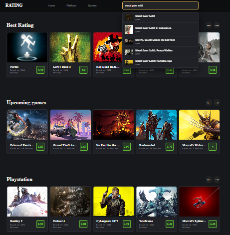
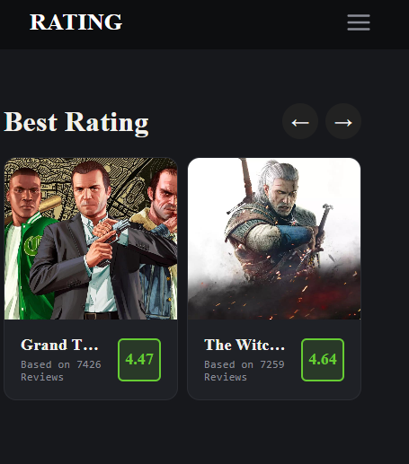

# 🎮 Game Discovery

A modern and responsive game discovery website built with **React.js** and the **RAWG Video Games Database API**. Browse thousands of games, search by title, explore game details, and discover the latest and upcoming releases through a clean, user-friendly interface.

  
  

## ✨ Features

* 🔍 Search for games by name with live search suggestions.
* 🏆 Browse top-rated games in an interactive Swiper slider.
* 🆕 View newly released games.
* 📅 Explore upcoming game releases fetched directly from the RAWG API.
* 🎮 Browse PlayStation games using dedicated API requests.
* 🖼️ View screenshots for every game on the Game Details page.
* 🕹️ Display supported platforms for each game.
* 📖 Read detailed game information, including description, release date, and rating.
* 📱 Fully responsive design optimized for desktop, tablet, and mobile devices.
* ⚡ Fast and dynamic data fetching using the Fetch API.
* 🧭 Client-side routing with React Router.

## 🛠️ Technologies Used

* React.js
* JavaScript (ES6+)
* HTML5
* CSS3
* React Router
* Swiper.js
* RAWG Video Games Database API

## 📂 Pages

### Home

* Hero section featuring top-rated games.
* Search bar with live suggestions.
* New Releases section.
* Upcoming Games section.
* PlayStation Games section.

### Game Details

* Game title and background image.
* Game description.
* Release date.
* Rating.
* Supported platforms.
* Game screenshots gallery.

## 📡 API Endpoints Used

* Search Games
* Game Details
* Game Screenshots
* Upcoming Games
* New Releases
* PlayStation Games

## 👨‍💻 Author

**Yassin Nassrallah**

GitHub: https://github.com/YassinNasrallah

